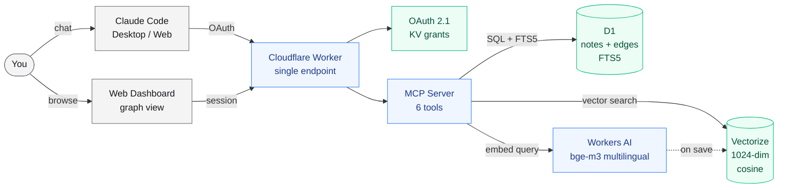
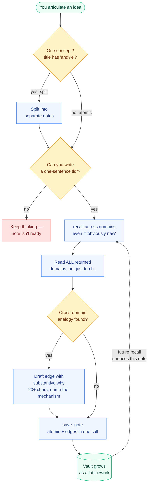

# Mind Vault — a personal knowledge graph for Claude, built on Cloudflare

**The latticework thinking tool for people who talk to Claude.** Mind Vault is a single-user, self-hosted knowledge graph that runs entirely in your own Cloudflare account and plugs into Claude Code, Claude Desktop, or Claude Web as an MCP server. You talk to Claude about ideas, Claude decides what is worth keeping, atomizes the concept, sweeps the vault for cross-domain analogies, and saves the note with edges that name the shared *mechanism* — not just "related".

**Not a notes app. A thinking tool.**

- ✅ **Concepts, not pages.** Every note is one idea, titled in one line, summarized in one sentence (Feynman test).
- ✅ **Edges with substance.** 9 typed relations (`analogous_to`, `same_mechanism_as`, `contradicts`, `refines`, …) each requiring a 20-character minimum *why* — the mechanism behind the connection.
- ✅ **Cross-domain by design.** Recall is domain-balanced — the vault surfaces the unexpected match from another field, because that's where insight lives.
- ✅ **Multilingual.** Write in Portuguese, English, or whatever the conversation is in. The embedding model (`bge-m3`) retrieves across 100+ languages.
- ✅ **Sovereign.** Everything lives in your Cloudflare account — D1 (SQLite), Vectorize (embeddings), Workers AI. No third party, no lock-in, no subscription.
- ✅ **OAuth 2.1 + dynamic client registration.** Claude Desktop and Claude Web plug in with just the URL; no token juggling.

## Who is this for?

- **Developers who live in Claude Code** and want their learnings to compound across sessions instead of evaporating at the end of each conversation.
- **Anyone looking for a "Claude-native" alternative to Obsidian or Notion** for idea capture — specifically the cross-domain, analogy-driven style from Charlie Munger's latticework of mental models or Luhmann's Zettelkasten.
- **Writers, researchers, thinkers** who read across fields and want a second brain that *forces* them to look for the structural overlap instead of burying notes in folders.

Mind Vault is **not** a replacement for a daily-capture notes app. It is for the subset of your thinking worth preserving with rigor — the ideas you want to find again, in a different context, years later.

## When Mind Vault makes sense (and when it doesn't)

Mind Vault is an opinionated tool. It is not "notes for Claude" — it is a discipline wrapped in an MCP server. Before installing it, check yourself against these lists.

### ✅ Use Mind Vault if…

- **You read or work across multiple domains** and want the structural analogies between them to surface automatically. The whole point of the vault is to notice that a pattern you just hit in software engineering is the same shape as a pattern you read about in evolutionary biology last year.
- **You already live inside Claude Code, Claude Desktop, or a Claude-compatible client.** Mind Vault is an MCP server — its value comes from being reachable without leaving the conversation.
- **You make judgment calls with reasoning worth preserving** — design decisions, research conclusions, strategic bets. The vault protects the *why* so you can revisit it later.
- **You are on Pro, Max, or the API** and can afford the ~2,400-token overhead per cold request. On Max 5x/20x this is negligible.
- **You believe in the Munger/Luhmann method**: atomize one concept per note, link with substantive whys, prefer cross-domain structure over folders. If you don't buy the method, the tool will feel like friction.

### ❌ Skip Mind Vault if…

- **You're on Claude Free.** The MCP overhead eats ~27% of your 5-hour window before you type anything. Not worth it.
- **You want a daily journal or task list.** The vault is ruthless by design — it rejects ephemeral capture. Use Obsidian, Notion, or Apple Notes.
- **You only work within one narrow domain.** The value proposition is cross-domain recall. A single-domain user gets most of the benefit from a plain markdown folder and `grep`.
- **You don't use Claude as your primary interface.** The vault is readable from a web dashboard, but the *writing* discipline only works when an LLM is mediating the save flow. Without that, you'll drift back to dumping notes.
- **You want a second brain that captures everything.** Mind Vault punishes low-signal saves — sloppy notes pollute future recalls. If you can't articulate a one-sentence tldr, the note isn't ready.
- **You need offline access or local-only storage.** The vault runs on Cloudflare D1 + Vectorize. Your notes leave your machine.
- **You care about preserving the exact surface wording of what you wrote.** The vault nudges toward atomization and rewriting — it is a thinking tool, not an archival tool.

### The honest one-liner

Mind Vault is worth it when you treat it as **a discipline for the ideas you'll actually want again**, not as a place to dump things. If that distinction doesn't resonate, you probably don't need it yet.

## 💰 Cost: $0 — runs entirely on Cloudflare's free tier

Before you deploy anything, read this: **you will not be charged**. Mind Vault runs on Cloudflare's free tier, which is generous enough that a personal vault never comes close to the limits:

| Service | Free tier | What a personal vault uses |
|---|---|---|
| Workers (the server) | 100,000 requests/day | ~50 reqs/day in active use |
| D1 (the database) | 5 GB storage, 5M reads/day, 100k writes/day | A few MB, hundreds of reads |
| Vectorize (the search) | 5M stored vectors, 30M queries/month | A few thousand at most |
| Workers AI (embeddings) | 10,000 neurons/day | A few hundred |
| KV (OAuth tokens) | 100k reads/day, 1k writes/day | Single-digit reads per login |

**No credit card required** to create a Cloudflare account. You can sign up with just an email at [cloudflare.com/sign-up](https://dash.cloudflare.com/sign-up), verify the email, and you're ready. Even if you exceeded the free tier (you won't), Cloudflare shows warnings before charging anything — never a surprise bill.

## ⚠️ The real cost: Claude tokens

The infrastructure is free, but connecting the MCP to Claude is **not** free from the token budget's perspective. You need to understand this before deciding if Mind Vault is worth it for your usage pattern.

### What it costs

| Cost | Tokens | When you pay |
|---|---|---|
| MCP always-on overhead | **~2,400** | Every request while the MCP is connected (cacheable, 5-min TTL) |
| `using-mind-vault` skill | ~1,300 | Only when the skill is invoked (don't invoke if MCP is connected — it duplicates the tool descriptions) |
| `recall` response | 100–300 | Per call (returns tldrs only, never bodies — cheap by design) |
| `get_note` response | 500–2,000 | Per call (full body) |

The ~2,400 tokens come from the tool descriptions and usage instructions that the MCP injects into the system prompt ([`src/mcp/instructions.ts`](src/mcp/instructions.ts) + the 6 tool schemas). They load on **every** request while the MCP is connected, whether or not you actually use the vault that turn. The prompt cache (5-min TTL) makes this near-free during active back-and-forth, but you re-pay it on every cold start.

### Impact by Claude plan

Anthropic doesn't publish exact token quotas for consumer plans, but here's the practical read based on community-observed numbers:

| Plan | Usage window | Observed budget | MCP overhead as % of window |
|---|---|---|---|
| **Free** | 5h rolling | very tight (~9k tok effective) | ~27% — **don't use** Mind Vault on Free |
| **Pro** ($20/mo) | 5h rolling + weekly cap | ~44k tok per 5h window | ~5.5% per cold request |
| **Max 5x** ($100/mo) | 5h rolling + weekly cap | ~220k tok per 5h window | ~1.1% |
| **Max 20x** ($200/mo) | 5h rolling + weekly cap | ~880k tok per 5h window | ~0.3% |
| **API** (Claude Code / SDK) | no window, pay per token | unlimited | billed directly (~$0.036/cold turn on Opus, ~$0.0036 cached) |

Key things to know about the plan windows:

- **All paid plans use a 5-hour rolling window**, not a daily reset. Messages fall off 5 hours after you sent them. Check `/usage` in Claude Code or `claude.ai/settings/usage` to see live counters.
- **Weekly caps were added in August 2025** to Pro and Max for heavy users, on top of the 5h window. Mind Vault's fixed overhead contributes to this weekly counter too.
- **Peak hours burn faster**: on weekdays 5–11am PT / 1–7pm GMT, Anthropic tightens the 5h session limits during high demand. An MCP-connected session with 10 cold turns in peak hours can eat a noticeable chunk of a Pro window.
- **API billing is the opposite model**: no window, but every token is metered. Here the MCP overhead becomes a real line item. Cache discipline matters most.

### Practical recommendations

1. **Free plan**: don't bother. The MCP overhead eats too much of your tiny window.
2. **Pro plan**: connect the MCP selectively. For conversations that are going to touch the vault, keep it on. For an hour of UI work or debugging, disconnect it — you'll get noticeably more headroom in the 5h window.
3. **Max 5x / 20x**: leave it connected. The overhead is <1% of your window and the discipline encoded in the tool descriptions pays for itself the first time it prevents a bad note.
4. **API / Claude Code**: leave it connected in vault-centric sessions, disconnect in others. You're paying per token either way; cache warmth is your best lever.
5. **Never invoke the `using-mind-vault` skill while the MCP is connected** — it duplicates ~1,300 tokens of guidance the MCP already loaded. The skill exists for fallback environments (Gemini, Codex, etc.) without MCP support.
6. **Batch vault interactions** inside a single session. Five recalls in a row stay cached and are nearly free. Five recalls spread across the day pay cold-start each time.
7. **Prefer `recall` over `get_note`.** Read full bodies only when the tldr is insufficient. A 2k-token note read 5 times in a session is 10k tokens gone.

For the full methodology and per-tool breakdown, see [docs/token-cost.md](docs/token-cost.md).

## Quickstart — deploy your own Mind Vault in ~10 minutes

This is the **recommended path** for most people. It uses the Cloudflare CLI (`wrangler`) from your terminal — foolproof, step-by-step, no GitHub Actions voodoo needed.

**What you need:**
- A computer with Node.js 20+ installed ([nodejs.org](https://nodejs.org) if you don't have it)
- A free Cloudflare account ([sign up here](https://dash.cloudflare.com/sign-up) if you don't have one — takes 1 minute)
- A terminal (Terminal on macOS, PowerShell on Windows, any shell on Linux)

### Step 1 — Get the code

```bash
git clone https://github.com/orobsonn/mind-vault.git
cd mind-vault
npm install
```

### Step 2 — Log in to Cloudflare

```bash
npx wrangler login
```

This opens your web browser and takes you to a Cloudflare page that says "Allow Wrangler to manage your account". Click **Allow**. The browser will say "You have been logged in" and the terminal will say `Successfully logged in`. That's it — no API tokens, no secrets to save anywhere. `wrangler` stores a local auth token on your machine and uses it for every subsequent command.

> 💡 **Having trouble?** If the browser didn't open automatically, copy the URL that `wrangler` printed in the terminal and paste it into your browser manually. If you're on a headless server, add `--browser=false` to the command and follow the printed instructions.

Confirm it worked:

```bash
npx wrangler whoami
```

You should see your email and Cloudflare Account ID.

### Step 3 — Create the three Cloudflare resources Mind Vault needs

Run these three commands. Each one creates a resource in your account and prints an ID — **copy those IDs somewhere**, you will need them in Step 4.

```bash
# 1. The D1 database (SQLite for notes and edges)
npx wrangler d1 create mind-vault

# 2. The Vectorize index (for semantic search)
npx wrangler vectorize create mind-vault-embeddings --dimensions=1024 --metric=cosine

# 3. The KV namespace (for OAuth tokens)
npx wrangler kv namespace create OAUTH_KV
```

After each one, look at the output for the ID. For example, `wrangler d1 create` prints something like:
```
database_id = "a1b2c3d4-..."
```
And `wrangler kv namespace create` prints:
```
id = "e5f6g7h8..."
```

### Step 4 — Paste the IDs into `wrangler.toml`

Open `wrangler.toml` in your editor. Find these two lines and replace the existing IDs with the ones you just got in Step 3:

```toml
[[d1_databases]]
binding = "DB"
database_name = "mind-vault"
database_id = "PASTE_YOUR_D1_ID_HERE"   # ← from "wrangler d1 create"
migrations_dir = "src/db/migrations"

[[kv_namespaces]]
binding = "OAUTH_KV"
id = "PASTE_YOUR_KV_ID_HERE"            # ← from "wrangler kv namespace create"
```

(The Vectorize binding is referenced by name, not ID, so you don't need to edit it.)

### Step 5 — Deploy for the first time

```bash
npx wrangler deploy
```

Wait ~20 seconds. At the end it prints your Worker URL — something like `https://mind-vault.your-subdomain.workers.dev`. Copy it.

### Step 6 — Run the setup wizard

Open the Worker URL in your browser. Because the Worker has no secrets yet, it shows a **5-step setup wizard**:

1. **Credentials** — enter an email + a long passphrase (12+ chars). Click Save.
   - The next page shows your email and a PBKDF2-SHA256 hash of your passphrase, plus two `wrangler secret put` commands to run.
2. **Run the secret commands in your terminal:**
   ```bash
   npx wrangler secret put OWNER_EMAIL
   # paste your email when prompted, press Enter

   npx wrangler secret put OWNER_PASSWORD_HASH
   # paste the hash (the whole pbkdf2$sha256$... string) when prompted, press Enter
   ```
3. **Redeploy once** so the Worker picks up the new secrets:
   ```bash
   npx wrangler deploy
   ```
4. **Refresh the Worker URL in your browser.** It now shows the landing page instead of the wizard. Click **Provision database** once to run the D1 schema migration.
5. **Install the skill** — download the `using-mind-vault.zip` link from the landing and import it in your Claude client:
   - **Claude Code:** extract the ZIP to `~/.claude/skills/using-mind-vault/`
   - **Claude Desktop / Web:** Settings → Skills → Import → select the ZIP
6. **Connect Claude to the MCP:**
   - **Claude Code:** `claude mcp add --transport http mind-vault https://your-worker-url.workers.dev/mcp`
   - **Claude Desktop / Web:** Settings → Connectors → Add custom connector → paste the MCP URL. Claude opens an OAuth window — log in with the email + passphrase you set in step 1.
7. **(Recommended) Personalize Claude** — copy the block from card 5 of the landing into Claude → Settings → Personalization → Custom instructions. This makes Claude proactively use the latticework method in every conversation, not just when the topic is obvious.

### Step 7 — Start thinking

Open a new Claude conversation and share an idea:

> "I just realized tech debt behaves like compound interest — the longer you ignore it, the worse the rate gets."

Claude will call `MindVault:recall` to sweep the vault for analogies, then offer to save the note with `MindVault:save_note`, atomizing it into one concept per note and creating edges with substantive *why* justifications. You should see the MCP tool calls in the conversation UI.

---

### Alternative: One-click deploy

If you'd rather skip the terminal entirely and don't mind a less guided experience:

[](https://deploy.workers.cloudflare.com/?url=https://github.com/orobsonn/mind-vault)

This forks the repo into your GitHub account and provisions the bindings automatically. It works, but you'll still need to set the two secrets manually after the first deploy — the one-click flow gets you to the setup wizard, and from there it's the same as Step 6 above.

## Architecture



A single Cloudflare Worker serves three responsibilities on the same URL:

| Path | Function |
|---|---|
| `/` | Landing + setup wizard (first visit detects missing secrets and shows the wizard; after setup it shows vault status with connection badge + copy-pasteable MCP URL + skill download + personalization prompt) |
| `/authorize`, `/token`, `/register` | OAuth 2.1 via `@cloudflare/workers-oauth-provider` with dynamic client registration |
| `/mcp` | MCP endpoint protected by OAuth, served by `McpAgent` (`agents/mcp`) wrapping `McpServer` from `@modelcontextprotocol/sdk` |
| `/skill/using-mind-vault.zip` | The skill ZIP served as a static asset |
| `/status` | JSON vault status (notes, edges, OAuth clients, active tokens, connection state) |

**Bindings (all in `wrangler.toml`):**
- `DB` — D1 (SQLite) for notes, edges, tags, FTS5
- `VECTORIZE` — 1024-dim cosine index, one vector per note
- `AI` — Workers AI, model `@cf/baai/bge-m3` for multilingual embeddings
- `OAUTH_KV` — KV namespace for OAuth grants/tokens/client registrations
- `ASSETS` — static assets (skill ZIP)

**Schema (5 tables):**
- `notes(id, title, body, tldr, domains JSON, kind, created_at, updated_at)`
- `notes_fts` (virtual FTS5 on title + tldr + body, auto-synced via triggers)
- `tags(note_id, tag)` (escape hatch; real structure lives in edges)
- `edges(id, from_id, to_id, relation_type, why, created_at)` with `CHECK` enum of 9 relation types and `UNIQUE(from_id, to_id, relation_type)`
- `meta(key, value)` for singleton metadata

## MCP tools (what Claude calls)

| Tool | Purpose |
|---|---|
| `save_note` | Atomic note + edges in a single call. Validates edge `why` ≥ 20 chars, domain slugs against regex, edge target existence. |
| `recall` | Hybrid search: Workers AI embedding query + FTS5, merged and **domain-balanced** (max 3 per domain, up to 5 distinct domains). Returns only `{id, title, domain, kind, tldr}` — never the body. |
| `expand` | 1-hop neighbors of a note in the graph. |
| `get_note` | Full body + tags + edges of one note by id. |
| `link` | Create an edge between two existing notes (for when Claude spots a connection between prior saves mid-conversation). |

Tool descriptions are written in English with mandatory-flow instructions ("call `recall` first before `save_note`") and pedagogical error messages ("if the conversation is in Portuguese and you were going to use `biologia-evolutiva`, use `evolutionary-biology` instead") that teach Claude how to recover from mistakes in one shot.

## Method & intellectual lineage



This is not a clean-room design. Each decision has roots in a tradition:

- **Charlie Munger** — latticework of mental models, the value of cross-domain thinking. North star.
- **Scott E. Page**, *The Model Thinker* — diversity prediction theorem (diversity of models beats depth of one). Foundation for **domain-balanced recall**.
- **Douglas Hofstadter & Emmanuel Sander**, *Surfaces and Analogies* — analogy as the core of cognition. Foundation for the weight of `analogous_to` and `same_mechanism_as` edges.
- **Dedre Gentner**, *Structure-Mapping Theory* — the distinction between surface and structural similarity. Keeps edges honest.
- **Niklas Luhmann / Sönke Ahrens**, *How to Take Smart Notes* (Zettelkasten) — atomic notes, links with substance, emergent structure. Foundation for "one concept one note", "never link without a why", and "not every conversation becomes a note".
- **Richard Feynman** — if you cannot explain it simply, you do not understand it. Foundation for the mandatory `tldr` field.
- **Karl Popper** — fallibilism. Foundation for `contradicts` and `refines` as first-class edge types.

The public framing is **latticework thinking / many-model knowledge graph**, not "Munger mental models" — the academic basis (Page, Hofstadter, Gentner, Luhmann) is more rigorous than Munger's speeches alone.

## Advanced: auto-deploy on git push (optional)

> **Skip this section if you're not sure you need it.** The Quickstart above (with `wrangler login` + `wrangler deploy`) is enough for personal use — you only redeploy when you change code, and you can just run `wrangler deploy` again from your terminal.

This repo ships with a **GitHub Actions workflow** ([.github/workflows/deploy.yml](.github/workflows/deploy.yml)) that auto-deploys to your Worker on every push to `master` or `main`. Useful if you plan to modify Mind Vault and want your changes to ship automatically when you push to GitHub.

To enable it on your fork:

1. Create a Cloudflare API token: go to [dash.cloudflare.com/profile/api-tokens](https://dash.cloudflare.com/profile/api-tokens) → **Create Token** → use the "Edit Cloudflare Workers" template, then add these extra permissions: `D1 Edit`, `Vectorize Edit`, `Workers KV Storage Edit`, `Workers AI Edit`. Click Continue → Create Token → **copy the token shown** (you won't see it again).
2. Copy your Cloudflare Account ID: in any page of the Cloudflare dashboard, it's in the right sidebar.
3. In your GitHub fork, go to **Settings → Secrets and variables → Actions → New repository secret** and add:
   - `CLOUDFLARE_API_TOKEN` = the token from step 1
   - `CLOUDFLARE_ACCOUNT_ID` = the account ID from step 2
4. Push any commit to `master`. The workflow runs `npm run typecheck` + `npm test` + `npm run build:skill` before deploying, so a failing test blocks the deploy.

You can follow the runs at `https://github.com/YOUR_USER/mind-vault/actions`.

## Development

```bash
npm install
npm run dev          # wrangler dev on local Miniflare
npm test             # vitest-pool-workers (workers pool + node pool for auth)
npm run typecheck    # tsc --noEmit
npm run build:skill  # package skills/using-mind-vault/ into assets/using-mind-vault.zip
npm run deploy       # build skill + wrangler deploy
```

Tests run in two pools: the main workers pool (for D1 + MCP tool tests with mocked Vectorize / Workers AI), and a separate node pool for the password hashing test (`crypto.subtle` is available in both, but the node pool keeps the auth module isolated from the workers runtime constraints).

## Security

**Single-user by design.** Do not share the Worker URL. Access is gated by OAuth 2.1 using an email + passphrase hash stored as Worker secrets. The passphrase itself is hashed with PBKDF2-SHA256 at 100k iterations (Workers-capped — see `src/auth/password.ts`). The tokens issued by the OAuth provider are stored in the `OAUTH_KV` namespace.

If you want a multi-user version, fork and adapt — it is not a drop-in change. You will need per-user rows in D1, per-user Vectorize filtering, and a registration flow.

There is currently **no login rate limit**. Pull requests welcome.

## Free tier

D1 + Vectorize + Workers AI free tiers are sufficient for personal use. Confirm current limits on Cloudflare's pricing pages before relying on them for large vaults.

---

Made by **[Robson Lins](https://github.com/orobsonn)** · [Instagram](https://www.instagram.com/orobsonn) · [X / Twitter](https://x.com/orobsonnn) · [YouTube](https://youtube.com/@orobsonnn)
